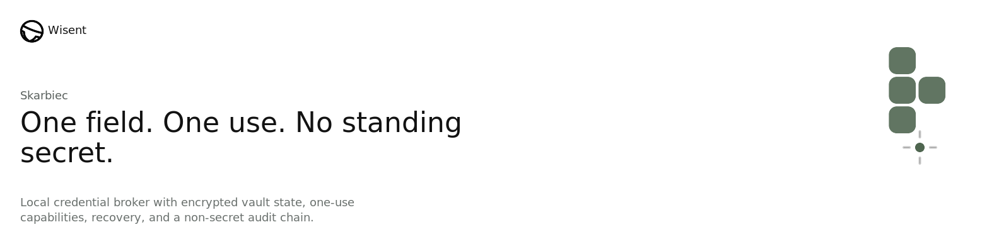
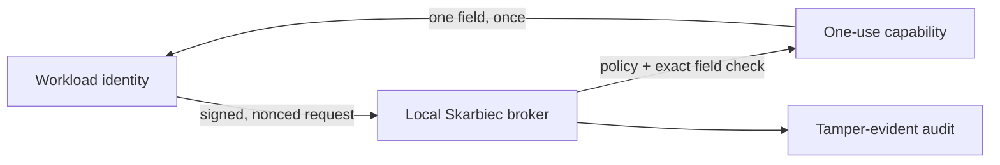
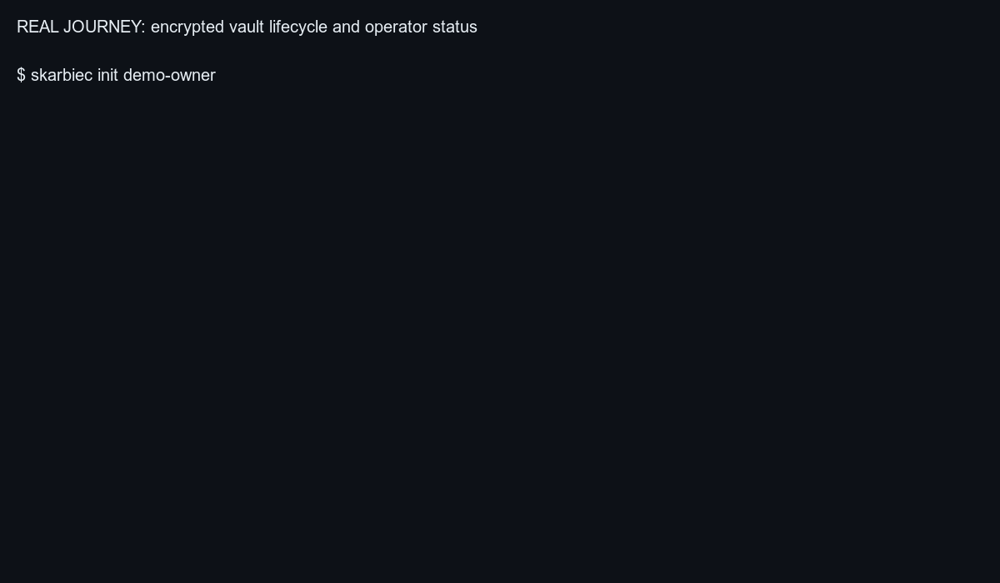

<p align="center">
  
</p>

<!-- wisent-readme-signals:start -->
[](https://github.com/wisent-ai/skarbiec) [](https://github.com/wisent-ai/skarbiec/issues) [](https://wisent.com) [](https://discord.gg/qRjpkthq54) [](https://www.linkedin.com/company/wisent-ai/) [](https://x.com/wisentai) [](https://calendly.com/lbartoszcze)
<!-- wisent-readme-signals:end -->

[](https://github.com/wisent-ai/skarbiec/discussions)

# Skarbiec: Secrets and Authentication Management for the AI Agent Era

Credential and Authentication Management for the AI Era.

Your devices hold your SSH keys, 2FA, API keys and card details. You don’t want
your AI to send them to an external provider, right? Skarbiec holds your
information in one accessible place — and makes sure only authorised AI have
access to it.

Since it is in one place, it also becomes easy to go full yolo — and give your
agent access to every secret you have so that it has nothing stopping it. But
this is not all! With embedded browser use integration through Weles, every
secret can be rotated and, if you are missing something, the agent can get a
secret independently and save it for future use. Think of this as 1Password and
Bitwarden reimagined for the AI Agent Era.

All Your Auth Needs Sorted with One Install of Skarbiec.

[Install](https://skarbiec.wisent.com/docs/install) · [Quick start](#quick-start) ·
[CLI](https://skarbiec.wisent.com/docs/cli) · [Examples](https://skarbiec.wisent.com/docs/examples) ·
[Security](https://skarbiec.wisent.com/docs/security) · [Contributing](CONTRIBUTING.md)

Skarbiec is an early public `0.2.x` product, not a hosted secret manager or a
claim that local brokering makes a compromised host safe. The complete local
broker works without a Wisent account, network licence check, item limit, or
paid seat. Operated fleet synchronization, retained organization audit,
governance, and custodied recovery are separate planned services.



## Problem and intended users

Long-lived environment variables and copied credential files give every process
that can read them the whole secret for an indefinite period. AI workloads make
that boundary harder to review: operators need to know which identity requested
which field, reject replay, revoke access, rotate recipients, and recover the
vault without putting plaintext into prompts or audit logs.

Skarbiec serves:

- **individual operators** storing and using credentials on machines they
  control;
- **agent and service owners** replacing standing read tokens with signed,
  one-use acquisition;
- **security and platform teams** defining exact consumer, item, and field
  grants and reviewing a hash-chained local journal;
- **recovery custodians** proving that an isolated recovery key can open a
  deterministic canary before an incident;
- **self-hosting teams** synchronizing ciphertext while retaining their own
  host, keyring, network, backup, and upgrade responsibilities.

## Product boundaries

Skarbiec stores API keys, logins, sessions, tokens, and typed fields as
per-recipient ciphertext. It supports scoped grants, finite capabilities,
field-bound acquisition, injection, sharing, TOTP, rotation, recovery,
emergency access, breach checks, audit verification, a loopback API, CLI, MCP
server, managed browser boundary, and self-hosted ciphertext sync.

It does **not** protect secrets from a host already compromised while the
matching owner key is usable; encrypt item names and other vault metadata;
replace OS permissions, GPG key custody, TLS, firewalling, backups, monitoring,
or recovery drills; or provide automatic plaintext cloud fallback. The optional
Weles path is a separate reviewed browser workflow—not blanket authority to
navigate providers, accept terms, or create credentials.

Every accepted credential action records non-sensitive identifiers. Secret
values, one-use tokens, signatures, and public keys are excluded from the audit
journal.

## Core use cases

| Goal | Observable outcome | Start here |
| --- | --- | --- |
| Let a new workload borrow one field | The workload has no standing read bearer; the first matching read succeeds and replay fails | [Executable acquisition proof](docs/examples/acquire-one-field.sh) |
| Store and inspect a credential without printing it | The write returns the item id; `list` returns metadata only | [Add a credential](docs/examples/add-credential.sh) |
| Share an item, then withdraw access | The recipient can decrypt only the shared item; revocation re-encrypts it to the remaining recipients | [Sharing example](docs/examples/sharing/share-credential-with-user.sh) |
| Replace a lost or departing owner | Every current and historical ciphertext is rewrapped and recovery remains present | [Owner rotation](https://skarbiec.wisent.com/docs/examples) |
| Prove recovery before an incident | An isolated custodian keyring opens and discards a deterministic canary and records pass/fail | [Recovery commands](https://skarbiec.wisent.com/docs/cli#recovery-and-emergency-access) |
| Move ciphertext between hosts | A replica receives encrypted vault state; local-only data is protected from accidental overwrite | [Sync examples](https://skarbiec.wisent.com/docs/examples#command-surfaces--which-tool-for-what) |

## Real product journeys

These GIFs are regenerated by `sh scripts/generate-readme-gifs.sh`. The command
builds the current source, executes each journey against a disposable vault and
isolated GPG keyring, checks its decisive outcome, and renders the resulting
terminal transcript. They are not mocked UI recordings.

### One field, one use, replay rejected

<p align="center">
  
</p>

### Recoverable deletion and restore

<p align="center">
  
</p>

### Encrypted vault lifecycle and operator status

<p align="center">
  
</p>

[Transcripts and SHA-256 provenance](assets/demos/manifest.json) are retained
beside the GIFs. The journeys use only explicit demonstration values and remove
their temporary vaults and keyrings after capture.

## How it works

1. **Store.** The owner writes a typed item. Each value is encrypted to the
   item's recipient set; the vault file never contains plaintext values.
2. **Register.** For a new consumer, the operator registers one exact
   `acquire:item#field` capability and an Ed25519 workload public key. Wildcards
   and direct capabilities cannot be mixed into that identity.
3. **Prove.** The workload signs the consumer, item, field, workload id,
   timestamp, and nonce. Skarbiec rejects stale proofs, capability mismatches, and
   replayed proof hashes.
4. **Borrow once.** Skarbiec issues an opaque bearer with a default 30-second
   TTL. The first successful matching read deletes its stored hash before
   returning the field.
5. **Record.** Issuance and consumption append non-sensitive identifiers to a
   hash-chained local journal. Values, signatures, and public keys are excluded.

At the failure boundary, authorization failures remain authorization failures.
An item that exists but cannot be decrypted returns `infra_down` rather than
masquerading as missing or dropping the connection. `key-doctor` reads the
vault and keyring directly, so diagnosis does not depend on a healthy broker.

The `error_code` in those replies is not skarbiec's own word. The vocabulary,
and what each code means -- its severity, whether it is retryable, whether it
names an outage -- come from
[`wisent-errors`](https://github.com/wisent-ai/wisent-errors), pinned by commit
in `Cargo.toml`. A caller deciding whether to retry a refused read is reading
the fleet's definition, not this repository's.

## Install

Use an exact, checksum-verified tagged archive for deployment. The complete
release and update procedure is in [Install and updates](https://skarbiec.wisent.com/docs/install).

Contributors can build and atomically install from source:

```sh
git clone https://github.com/wisent-ai/skarbiec
cd skarbiec
sh scripts/install.sh
```

`SKARBIEC_INSTALL_DIR` overrides the default `$HOME/.stado/bin`.

## Quick start

The canonical quick start is executable rather than a transcript that can drift.
From a source checkout with `skarbiec` installed, it creates a disposable vault,
an isolated GPG keyring, and an Ed25519 workload identity. It stores only the
literal non-secret value `not-a-secret`.

```sh
SKARBIEC_EXAMPLE_DIR="${TMPDIR:-/tmp}/skarbiec-acquisition-quickstart" \
  sh docs/examples/acquire-one-field.sh
```

The script performs the product's defining path:

1. create a vault and item;
2. register `demo-workload` for exactly `demo-note#value`, with no standing
   bearer;
3. sign a timestamped, nonced acquisition request with the workload key;
4. consume the issued capability once;
5. retry the same capability and receive `unauthorized`;
6. print the matching audit records.

Setup commands also print JSON. The decisive first read and replay have these
output shapes:

```json
{
  "consumer": "demo-workload",
  "field": "value",
  "item": "demo-note",
  "ok": true,
  "value": "not-a-secret"
}
{
  "error": "unauthorized",
  "ok": false
}
```

The registration output has `workload_bound: true`, `token: null`, and one exact
`acquire` capability. The final audit query contains `acquisition-issued` and
`acquisition-consumed`; it never contains the field value, signature, public
key, or one-use token.

The script refuses to overwrite an existing demo directory. Remove the isolated
state when finished:

```sh
rm -rf "${TMPDIR:-/tmp}/skarbiec-acquisition-quickstart"
```

For a real vault, first follow
[the recovery boundary](https://skarbiec.wisent.com/docs/security#recovery-and-rotation), move the
recovery private material to its custodian, and verify it with
`recovery-drill`. Store real values through stdin, as shown in
[the executable examples](https://skarbiec.wisent.com/docs/examples), and register new
workloads through acquisition rather than a legacy direct bearer.

## Primary interfaces

| Interface | Canonical purpose | Stability | Documentation and example |
| --- | --- | --- | --- |
| `skarbiec` CLI | Owner administration, diagnostics, and supervised automation | Public `0.2.x`; tracked by the versioned command surface | [CLI reference](https://skarbiec.wisent.com/docs/cli) · [Examples](https://skarbiec.wisent.com/docs/examples) |
| Loopback HTTP broker | Service acquisition, compatibility item access, health, and ciphertext sync | Public `/v1`; acquisition is the default, direct scopes are compatibility-only | [Acquisition contract](https://skarbiec.wisent.com/docs/cli#service-account-grants) · [Examples](https://skarbiec.wisent.com/docs/examples) |
| MCP server | Agent-safe metadata and audit, plus explicitly configured compatibility resolve | Public restricted surface; raw reads and administrative mutation are intentionally absent | [MCP boundary](https://skarbiec.wisent.com/docs/security#the-mcp-boundary-is-tighter-than-the-cli) · [Server commands](https://skarbiec.wisent.com/docs/cli#servers) |
| Chrome native host | Origin-checked fill through the managed extension | Public managed integration; the extension never receives a vault bearer or private key | [Browser boundary](https://skarbiec.wisent.com/docs/security#the-browser-boundary) · [Managed installation](https://skarbiec.wisent.com/docs/install#managed-browser-installation-and-updates) |
| Stado adapter | Preserve exact deployed Wisent consumer/item contracts over the broker | Compatibility interface outside the core binary | [Examples](https://skarbiec.wisent.com/docs/examples) |

The MCP surface deliberately excludes raw item reads, minting, rotation, and
export. Its compatibility `resolve` path writes a mode-0600 env file and returns
only the path and exported variable names. That path is not the acquisition
model and should not be used for new machine integrations.

## Operational model

### Configuration

| Setting | Meaning |
| --- | --- |
| `SKARBIEC_VAULT_FILE` | Vault path; defaults to `~/.local/share/skarbiec/skarbiec.vault.json` |
| `SKARBIEC_AUDIT_FILE` | Override the local append-only journal path |
| `SKARBIEC_UNLOCK_FILE` | Owner-only file supplying a protected key's unlock phrase to a persistent service |
| `SKARBIEC_UNLOCK` | Single-invocation unlock phrase, passed to `gpg` over stdin; prefer the file for services |
| `SKARBIEC_ACQUISITION_TTL_SECONDS` | One-use capability TTL from 1 through 300 seconds; default 30 |
| `SKARBIEC_MCP_CONSUMER` | Server-side consumer identity required to enable MCP resolve |
| `SKARBIEC_MCP_TOKEN_FILE` | Server-side compatibility grant file; never a tool argument |
| `SKARBIEC_MCP_OUT_DIR` | Required absolute directory for mode-0600 MCP resolve output |
| `SKARBIEC_HTTP_WORKERS` | Maximum concurrent HTTP handlers; default 16 |
| `SKARBIEC_HTTP_QUEUE` | Waiting HTTP requests before overload is refused; default 32 |
| `SKARBIEC_CRYPTO_CONCURRENCY` | Maximum concurrent external cryptographic tools; default 8 |
| `SKARBIEC_GPG_CONCURRENCY` | Maximum concurrent `gpg` processes sharing the keyring; default 2 |
| `SKARBIEC_CRYPTO_TIMEOUT_SECONDS` | Deadline after which a cryptographic child is killed and reaped; default 30 |
| `SKARBIEC_READINESS_ITEMS` | Comma-separated additional item ids `/readyz` must decrypt |

Run `skarbiec status` for the vault path and non-sensitive counts,
`skarbiec key-doctor` for key and decryptability diagnosis, `/livez` for process
liveness, and `/readyz` (or compatibility alias `/health`) for readiness.

### Ownership by concern

| Concern | Current owner and contract |
| --- | --- |
| Configuration | Operator-owned environment variables and owner-only files; the supported settings and defaults are listed above. There is no configuration file and no reload: an explicit variable wins over the built-in default, and each invocation reads the environment it was given |
| State | Three owner-only local files: the encrypted vault, the one-use acquisition state written beside it as `<vault>.acquisitions.json`, and the append-only audit journal, which defaults to `~/.local/state/skarbiec/audit.jsonl`. Each is written through a mode-0600 temporary file, `fsync`, and `rename` under a directory lock, so a reader sees the old document or the new one and never a partial write; the operator chooses the durable filesystem and its backups |
| Credentials | Values live in the vault only as per-recipient GPG ciphertext. Plaintext exists in exactly three places: the `gpg` child process and Skarbiec's own memory during a read or write, stdin when a value is stored, and the mode-0600 `<item>.env` file that the compatibility `resolve --emit` path writes on request. The protected-key path stages ciphertext — never plaintext — to a temporary file, and an unlock phrase reaches `gpg` over stdin rather than argv. Acquisition state stores only the SHA-256 hash of a one-use bearer, so the bearer itself cannot be recovered from disk. Scope is one exact consumer, item, and field; wildcards are refused. Rotation is `rotate-owner`, which rewraps every current and historical ciphertext onto the new recipient set or fails without writing anything. Revocation is `revoke`, which re-encrypts the item to the remaining recipients, `token-revoke` for a compatibility grant, and automatic deletion of a one-use capability once it is consumed or expires. The operator protects owner, workload, unlock, and recovery private material |
| Networking | `serve` binds `127.0.0.1` only, on port 8787 unless `--port` says otherwise. A fixed worker set and bounded waiting queue cap connections; overload is refused before it can consume cryptographic or file-descriptor capacity. The one connection Skarbiec itself initiates outward is `breach-check`, which sends the first five characters of a SHA-1 to `api.pwnedpasswords.com` and matches the returned suffixes locally. Ciphertext sync uses `git` against the remote the operator configures |
| Cost | The Apache-2.0 local core has no license fee or hosted dependency; the operator bears its host, storage, network, and operations costs. Hosted Hub pricing is not published because that service is not shipped |
| Observability | Skarbiec provides `/livez`, `/readyz`, compatibility alias `/health`, `status`, `key-doctor`, `audit-query`, `audit-epoch-start`, and `verify-chain`. The journal is synchronously durable before an audited operation returns; a signed epoch checkpoint preserves a broken historical journal without rewriting it |
| Upgrades | The operator pins a release tag and its published SHA-256, performs an atomic rollout, and retains the prior exact coordinate for rollback. A tag whose name disagrees with the version declared in `Cargo.toml` is refused before the first tagged artifact is built, and the publication workflow refuses to replace an existing asset, so changed bytes require a new tag |
| Recovery | Skarbiec preserves the recovery recipient through owner rotation and supplies `recovery-status` and `recovery-drill`; the custodian stores the private half off-host and exercises it before an incident. If no secret half present on the machine opens the vault and no recovery key is available, the ciphertext is readable by no one — there is no cloud fallback and no vendor-held copy |

The operator owns:

- the OS account, file permissions, GPG keyring, and unlock material;
- an exact release tag and checksum, with deliberate rollout and rollback;
- moving the recovery private half off the workload host and exercising
  `recovery-drill`;
- ciphertext backups or sync, service supervision, and broker availability;
- treating cleartext item ids, tags, recipient names, and audit identifiers as
  sensitive metadata where appropriate.

Skarbiec owns:

- atomic, locked vault and acquisition-state writes;
- per-recipient encryption and exact consumer/item/field authorization;
- replay, expiry, and binding checks before a value is returned;
- failure-closed behavior and distinct authorization versus infrastructure
  errors;
- a hash-chained audit trail that reveals no secret values.

GPG remains the external encryption and key-custody boundary; OpenSSL supplies
high-entropy tokens, while SHA-256 journal hashing and timestamps run in-process
so an audit entry cannot exhaust subprocess capacity. See the complete
[security model](https://skarbiec.wisent.com/docs/security) and [architecture](https://skarbiec.wisent.com/docs/architecture).

## Documentation

- **Choose and install a release:** [Install and updates](https://skarbiec.wisent.com/docs/install)
- **Use a command or integration surface:** [CLI reference](https://skarbiec.wisent.com/docs/cli)
- **Run an end-to-end task:** [Executable examples](https://skarbiec.wisent.com/docs/examples)
- **Review trust and failure boundaries:** [Security model](https://skarbiec.wisent.com/docs/security)
- **Understand storage and network design:** [Architecture](https://skarbiec.wisent.com/docs/architecture)
- **Understand current priorities and planned work:** [Product contract](https://skarbiec.wisent.com/docs/product-contract)
- **Trace the public code lineage:** [Lineage](https://skarbiec.wisent.com/docs/lineage)
- **Prepare a change:** [Contributing guide](CONTRIBUTING.md)

## Project status and support

Skarbiec is an **early public `0.2.x` release**, not a hosted secrets service.
Deploy an exact release tag and checksum; do not infer readiness from
`Cargo.toml` or a mutable `latest` pointer.

| Boundary | Current contract |
| --- | --- |
| Maturity | Early public `0.2.x`. The local broker, acquisition flow, sharing, recovery, audit, sync, MCP boundary, and managed browser extension are shipped; the fleet-level Hosted Hub is planned commercial work and is not part of this repository |
| Latest complete release | [`v0.2.32`](https://github.com/wisent-ai/skarbiec/releases/tag/v0.2.32) |
| Supported release targets | `darwin-arm64` and `linux-amd64` |
| Runtime dependencies | `gpg` and `openssl`; `shasum` only for breach checking and `oathtool` only for TOTP |
| Storage | One local JSON vault; values are per-recipient GPG ciphertext |
| Metadata | Item ids, types, tags, recipients, and revision counts are cleartext |
| Default machine access | Ed25519 workload proof → one short-lived, one-use, field-bound capability |
| Compatibility access | Direct scoped bearers and owner-only emitted env files remain for existing consumers |
| Network | Local CLI, MCP, native messaging, or the HTTP broker; no hosted control plane is required |
| Availability | No cloud fallback by design; if the local broker cannot decrypt, the integration is unavailable |
| Versioning | Additions require an additive bump; removals or changed command contracts require a compatibility-breaking bump |
| Distribution | Canonical Stado releases for both supported platforms, plus the signed `skarbiec-autofill.crx` and its update manifest on the Linux recipe. Contributors can build and install from source with `sh scripts/install.sh`. There is no package-registry distribution |
| License | [Apache License, Version 2.0](LICENSE); copies previously received under MIT remain under that grant. The license grants no trademark rights |

Not supported or promised:

- no published Windows target;
- no protection from a host already compromised while an owner key is
  available;
- no encryption of item names or other vault metadata;
- no automatic cloud fallback, secret replication in plaintext, or mutable
  release channel;
- no claim that legacy direct grants provide the acquisition model's one-use
  identity guarantee.

The local core, acquisition flow, sharing, recovery, audit, sync, MCP boundary,
and managed browser extension exist today. The fleet-level **Hosted Hub**
described in [the product contract](https://skarbiec.wisent.com/docs/product-contract#monetization-assessment)
is planned commercial control-plane work, not a dependency or capability of the
current core.

### Compatibility, releases, and support

`Cargo.toml` is the package-version source. Stado resolves
`.wisent-release.json`, runs the repository-owned quality and build entrypoints,
and stores immutable signed receipts for both supported platforms. The Linux
recipe receives the browser signing key only as the file-backed
`browser-extension-key#private_key` Skarbiec grant; the key is never stored in
source or a release asset. Promotion reconciles the same immutable receipts from
`candidate` to `stable`.

- Resolve downloadable assets from the canonical Stado release receipt.
- Commercial or account support is not applicable to the local core; Hosted Hub
  is planned and has no published paid contract.
- Ask design and usage questions in
  [GitHub Discussions](https://github.com/wisent-ai/skarbiec/discussions).
- Report reproducible bugs and request features in
  [GitHub Issues](https://github.com/wisent-ai/skarbiec/issues).
- Join the [Wisent Discord](https://discord.gg/qRjpkthq54) for community chat.
- Report vulnerabilities privately through
  [GitHub Security Advisories](https://github.com/wisent-ai/skarbiec/security/advisories/new).

### Contributing

Read [CONTRIBUTING.md](CONTRIBUTING.md) before changing a command contract,
vault format, trust boundary, or release surface. It defines the issue and
security-reporting routes, development prerequisites, required documentation
and examples, local checks, pull-request evidence, compatibility classification,
and maintainer-only release process.

### License

Apache License, Version 2.0 — see [LICENSE](LICENSE). Existing copies previously
received under MIT remain under that grant.

The software license grants no trademark rights.