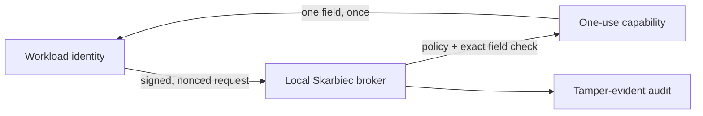

<p align="center">
  
</p>

<!-- wisent-readme-signals:start -->
[](https://github.com/wisent-ai/skarbiec) [](https://github.com/wisent-ai/skarbiec/issues) [](https://wisent.com) [](https://discord.gg/qRjpkthq54) [](https://www.linkedin.com/company/wisent-ai/) [](https://x.com/wisentai) [](https://calendly.com/lbartoszcze)
<!-- wisent-readme-signals:end -->

[](https://github.com/wisent-ai/skarbiec/discussions)

# Skarbiec: Secrets and Authentication Management for the AI Agent Era

Credential and Authentication Management for the AI Era.

Your devices hold your SSH keys, 2FA, API keys and card details. You don’t want
your AI to send them to an external provider, right? Skarbiec holds your
information in one accessible place — and makes sure only authorised AI have
access to it.

Since it is in one place, it also becomes easy to go full yolo — and give your
agent access to every secret you have so that it has nothing stopping it. But
this is not all! With embedded browser use integration through Weles, every
secret can be rotated and, if you are missing something, the agent can get a
secret independently and save it for future use. Think of this as 1Password and
Bitwarden reimagined for the AI Agent Era.

All Your Auth Needs Sorted with One Install of Skarbiec.

[Install](https://skarbiec.wisent.com/docs/install) · [Quick start](#quick-start) ·
[CLI](https://skarbiec.wisent.com/docs/cli) · [Examples](https://skarbiec.wisent.com/docs/examples) ·
[Security](https://skarbiec.wisent.com/docs/security) · [Contributing](CONTRIBUTING.md)

Skarbiec is an early public `0.2.x` product, not a hosted secret manager or a
claim that local brokering makes a compromised host safe. The complete local
broker works without a Wisent account, network licence check, item limit, or
paid seat. Operated fleet synchronization, retained organization audit,
governance, and custodied recovery are separate planned services.



## Problem and intended users

Long-lived environment variables and copied credential files give every process
that can read them the whole secret for an indefinite period. AI workloads make
that boundary harder to review: operators need to know which identity requested
which field, reject replay, revoke access, rotate recipients, and recover the
vault without putting plaintext into prompts or audit logs.

Skarbiec serves:

- **individual operators** storing and using credentials on machines they
  control;
- **agent and service owners** replacing standing read tokens with signed,
  one-use acquisition;
- **security and platform teams** defining exact consumer, item, and field
  grants and reviewing a hash-chained local journal;
- **recovery custodians** proving that an isolated recovery key can open a
  deterministic canary before an incident;
- **self-hosting teams** synchronizing ciphertext while retaining their own
  host, keyring, network, backup, and upgrade responsibilities.

## Product boundaries

Skarbiec stores API keys, logins, sessions, tokens, and typed fields as
per-recipient ciphertext. It supports scoped grants, finite capabilities,
field-bound acquisition, injection, sharing, TOTP, rotation, recovery,
emergency access, breach checks, audit verification, a loopback API, CLI, MCP
server, managed browser boundary, and self-hosted ciphertext sync.

It does **not** protect secrets from a host already compromised while the
matching owner key is usable; encrypt item names and other vault metadata;
replace OS permissions, GPG key custody, TLS, firewalling, backups, monitoring,
or recovery drills; or provide automatic plaintext cloud fallback. The optional
Weles path is a separate reviewed browser workflow—not blanket authority to
navigate providers, accept terms, or create credentials.

Every accepted credential action records non-sensitive identifiers. Secret
values, one-use tokens, signatures, and public keys are excluded from the audit
journal.

## Core use cases

| Goal | Observable outcome | Start here |
| --- | --- | --- |
| Let a new workload borrow one field | The workload has no standing read bearer; the first matching read succeeds and replay fails | [Executable acquisition proof](docs/examples/acquire-one-field.sh) |
| Issue a finite capability against a routed credential | Issuance refuses before handing one out, naming the coordinate and the reason, unless the credential the route names can actually serve | [Capability issuance example](docs/examples/operations/issue-a-capability.sh) |
| Store and inspect a credential without printing it | The write returns the item id; `list` returns metadata only | [Add a credential](docs/examples/add-credential.sh) |
| Share an item, then withdraw access | The recipient can decrypt only the shared item; revocation re-encrypts it to the remaining recipients | [Sharing example](docs/examples/sharing/share-credential-with-user.sh) |
| Replace a lost or departing owner | Every current and historical ciphertext is rewrapped and recovery remains present | [Owner rotation](https://skarbiec.wisent.com/docs/examples) |
| Prove recovery before an incident | An isolated custodian keyring opens and discards a deterministic canary and records pass/fail | [Recovery commands](https://skarbiec.wisent.com/docs/cli#recovery-and-emergency-access) |
| Move ciphertext between hosts | A replica receives encrypted vault state; local-only data is protected from accidental overwrite | [Sync examples](https://skarbiec.wisent.com/docs/examples#command-surfaces--which-tool-for-what) |

## Real product journeys

These GIFs are regenerated by `sh scripts/generate-readme-gifs.sh`. The command
builds the current source, executes each journey against a disposable vault and
isolated GPG keyring, checks its decisive outcome, and renders the resulting
terminal transcript. They are not mocked UI recordings.

### One field, one use, replay rejected

<p align="center">
  
</p>

### Recoverable deletion and restore

<p align="center">
  
</p>

### Encrypted vault lifecycle and operator status

<p align="center">
  
</p>

[Transcripts and SHA-256 provenance](assets/demos/manifest.json) are retained
beside the GIFs. The journeys use only explicit demonstration values and remove
their temporary vaults and keyrings after capture.

## How it works

1. **Store.** The owner writes a typed item. Each value is encrypted to the
   item's recipient set; the vault file never contains plaintext values.
2. **Register.** For a new consumer, the operator registers one exact
   `acquire:item#field` capability and an Ed25519 workload public key. Wildcards
   and direct capabilities cannot be mixed into that identity.
3. **Prove.** The workload signs the consumer, item, field, workload id,
   timestamp, and nonce. Skarbiec rejects stale proofs, capability mismatches, and
   replayed proof hashes.
4. **Borrow once.** Skarbiec issues an opaque bearer with a default 30-second
   TTL. The first successful matching read deletes its stored hash before
   returning the field.
5. **Record.** Issuance and consumption append non-sensitive identifiers to a
   hash-chained local journal. Values, signatures, and public keys are excluded.

At the failure boundary, authorization failures remain authorization failures.
An item that exists but cannot be decrypted returns `infra_down` rather than
masquerading as missing or dropping the connection. `key-doctor` reads the
vault and keyring directly, so diagnosis does not depend on a healthy broker.

The `error_code` in those replies is not skarbiec's own word. The vocabulary,
and what each code means -- its severity, whether it is retryable, whether it
names an outage -- come from
[`wisent-errors`](https://github.com/wisent-ai/wisent-errors), pinned by commit
in `Cargo.toml`. A caller deciding whether to retry a refused read is reading
the fleet's definition, not this repository's.

## Install

Use an exact, checksum-verified tagged archive for deployment. The complete
release and update procedure is in [Install and updates](https://skarbiec.wisent.com/docs/install).

Contributors can build and atomically install from source:

```sh
git clone https://github.com/wisent-ai/skarbiec
cd skarbiec
sh scripts/install.sh
```

`SKARBIEC_INSTALL_DIR` overrides the default `$HOME/.stado/bin`.

## Quick start

Start with the credentials you already have. Select an existing vault with
`SKARBIEC_VAULT_FILE`, or create one with `skarbiec init <owner-uid>`, then import
your password-manager or browser export:

```sh
skarbiec import "$HOME/Downloads/1PasswordExport.1pux" --format 1password
# Alternatively, import during setup:
skarbiec onboarding --import "$HOME/Downloads/bitwarden.json" --format bitwarden
```

The importer accepts 1Password 1PUX v3/JSON/CSV, unencrypted Bitwarden JSON/CSV,
browser CSV, and canonical Skarbiec JSON rows. The default `--conflict keep`
preserves existing values; `replace` is explicit and `error` refuses a changed
existing record before any write. A repeated source identity reuses the saved
item even after a local rename. The complete accepted batch is encrypted before
one generation-checked vault save; the source export is never changed.

Desktop offers the same operation in first use and **Items → Import existing
items**, including vault selection or creation, counts, warnings, and access to
the actual saved records and attachments. On the CLI the entry points are
`skarbiec import` and `skarbiec onboarding --import` above; the first-use
walkthrough names them and asks nothing that could be mistaken for a file
name. See [formats, retained fields, limits and refusals](https://skarbiec.wisent.com/docs/import)
for the complete `0.3.0` source contract.

### Optional acquisition walkthrough

The acquisition walkthrough is executable rather than a transcript that can drift.
From a source checkout with `skarbiec` installed, it creates a disposable vault,
an isolated GPG keyring, and an Ed25519 workload identity. It stores only the
literal non-secret value `not-a-secret`.

```sh
SKARBIEC_EXAMPLE_DIR="${TMPDIR:-/tmp}/skarbiec-acquisition-quickstart" \
  sh docs/examples/acquire-one-field.sh
```

The script performs the product's defining path:

1. create a vault and item;
2. register `demo-workload` for exactly `demo-note#value`, with no standing
   bearer;
3. sign a timestamped, nonced acquisition request with the workload key;
4. consume the issued capability once;
5. retry the same capability and receive `unauthorized`;
6. print the matching audit records.

Setup commands also print JSON. The decisive first read and replay have these
output shapes:

```json
{
  "consumer": "demo-workload",
  "field": "value",
  "item": "demo-note",
  "ok": true,
  "value": "not-a-secret"
}
{
  "error": "unauthorized",
  "ok": false
}
```

The registration output has `workload_bound: true`, `token: null`, and one exact
`acquire` capability. The final audit query contains `acquisition-issued` and
`acquisition-consumed`; it never contains the field value, signature, public
key, or one-use token.

`POST /v1/acquisitions` returns `400` when a required request member is
missing, the id or field is empty, or the timestamp is not an unsigned integer.
Supplied item, field, or workload values that fail exact-name or workload-proof
validation return `401` with `{"error":"unauthorized"}`, as do an absent
consumer, a missing acquisition grant, an expired timestamp, or a replay.
After the workload has proved its identity, a field that the item does not
carry returns `404` with `{"error":"acquisition field does not exist on item"}`;
other issuance failures return `503` with `{"error":"infra_down"}`. The
missing-field distinction is therefore available to an authorized workload
without exposing field existence to an unproved caller.

The script refuses to overwrite an existing demo directory. Remove the isolated
state when finished:

```sh
rm -rf "${TMPDIR:-/tmp}/skarbiec-acquisition-quickstart"
```

For a real vault, first follow
[the recovery boundary](https://skarbiec.wisent.com/docs/security#recovery-and-rotation), move the
recovery private material to its custodian, and verify it with
`recovery-drill`. Store real values through stdin, as shown in
[the executable examples](https://skarbiec.wisent.com/docs/examples), and register new
workloads through acquisition rather than a legacy direct bearer.

## Primary interfaces

| Interface | Canonical purpose | Stability | Documentation and example |
| --- | --- | --- | --- |
| `skarbiec` CLI | Owner administration, diagnostics, and supervised automation | Public `0.2.x`; tracked by the versioned command surface | [CLI reference](https://skarbiec.wisent.com/docs/cli) · [Examples](https://skarbiec.wisent.com/docs/examples) |
| Loopback HTTP broker | Service acquisition, compatibility item access, health, and ciphertext sync | Public `/v1`; acquisition is the default, direct scopes are compatibility-only | [Acquisition contract](https://skarbiec.wisent.com/docs/cli#service-account-grants) · [Examples](https://skarbiec.wisent.com/docs/examples) |
| MCP server | Agent-safe metadata and audit, plus explicitly configured declared route resolution | Public restricted surface; raw reads and administrative mutation are intentionally absent | [MCP boundary](https://skarbiec.wisent.com/docs/security#the-mcp-boundary-is-tighter-than-the-cli) · [Server commands](https://skarbiec.wisent.com/docs/cli#servers) |
| Chrome native host | Origin-checked fill through the managed extension | Public managed integration; the extension never receives a vault bearer or private key | [Browser boundary](https://skarbiec.wisent.com/docs/security#the-browser-boundary) · [Managed installation](https://skarbiec.wisent.com/docs/install#managed-browser-installation-and-updates) |
| Stado adapter | Preserve exact deployed Wisent consumer/item contracts over the broker | Compatibility interface outside the core binary | [Examples](https://skarbiec.wisent.com/docs/examples) |

The MCP surface deliberately excludes raw item reads, minting, rotation, and
export. Its `skarbiec_route_resolve` tool writes a mode-0600 env file and returns
only the path and exported variable names. That path is not the acquisition
model and should not be used for new machine integrations.

## Documentation

- **Choose and install a release:** [Install and updates](https://skarbiec.wisent.com/docs/install)
- **Use a command or integration surface:** [CLI reference](https://skarbiec.wisent.com/docs/cli)
- **Run an end-to-end task:** [Executable examples](https://skarbiec.wisent.com/docs/examples)
- **Review trust and failure boundaries:** [Security model](https://skarbiec.wisent.com/docs/security)
- **Understand storage and network design:** [Architecture](https://skarbiec.wisent.com/docs/architecture)
- **Understand current priorities and planned work:** [Product contract](https://skarbiec.wisent.com/docs/product-contract)
- **Trace the public code lineage:** [Lineage](https://skarbiec.wisent.com/docs/lineage)
- **Prepare a change:** [Contributing guide](CONTRIBUTING.md)
- **Run and configure a host:** [Operating Skarbiec](docs/operations.md)
- **Read the release's boundaries and support contract:** [Project status and support](docs/status.md)
