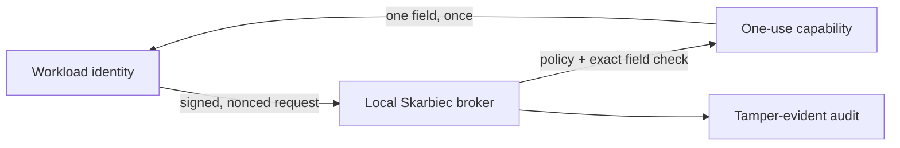

# skarbiec

World’s Best Credential Management and Authentication Solution.

Built for AI Agents.

Never use .env again. Share credentials easily across machines and projects.
Eliminate the pain of manually clicking through interfaces to get API Keys. Get
full logs of your agent’s actions. Give them scoped tokens to prevent credential
leakage. Automatically rotate them whenever you want.

<!-- wisent-readme-signals:start -->
[](https://github.com/wisent-ai/skarbiec/actions/workflows/ci.yml)
[](https://github.com/wisent-ai/skarbiec/releases)
[](https://github.com/wisent-ai/skarbiec/releases)
[](https://github.com/wisent-ai/skarbiec)
[](https://discord.gg/qRjpkthq54)
<!-- wisent-readme-signals:end -->

[](https://github.com/wisent-ai/skarbiec/discussions)

[Install](docs/INSTALL.md) · [Quick start](#quick-start) · [CLI](docs/CLI.md) · [Examples](docs/examples/README.md) · [Security](docs/SECURITY.md) · [Contributing](CONTRIBUTING.md)



## Everything You and Your agents need to authenticate

Skarbiec manages the entire credential lifecycle. We help you obtain, store,
share, use, rotate, revoke, recover, and audit credentials. We move your
credentials between teams of human users and AI agents. No need to store them in
.env files or secret managers that only work on one cloud and vendor lock you.
We are to 1Password and Bitwarden what Cursor is to VSCode. A new experience
built with agents in mind.

Store API keys, logins, sessions, and tokens once in an encrypted vault, then
use them safely across machines and projects without copying .env files. Host it
yourself, pay us to host it or use peer-to-peer for truly decentralised
credential management.

Give every agent exactly the access it needs. Scope access to a specific
credential or field, make it short-lived or single-use, and revoke or rotate it
without hunting through repositories, servers, and deployment settings.

Skarbiec can ask Weles (our automated Internet browser) to navigate the provider
flow, obtain or refresh a credential, and save it directly into the vault. The
credential never needs to pass through a chat, prompt, source file, or manual
copy-and-paste step. The next time your agent tells you to click through some
boring and confusing website to get a credential, tell him to go to skarbiec and
sort itself out.

Every accepted credential action leaves an audit record. You see clearly which
agent requested access, what it requested, and when it happened without
recording the credential itself.

## Scope and product status

Skarbiec is an **early public `0.1.x` release**, not a hosted secrets service.
Deploy an exact release tag and checksum; do not infer readiness from
`Cargo.toml` or a mutable `latest` pointer.

| Boundary | Current contract |
| --- | --- |
| Latest complete release | [`v0.1.3`](https://github.com/wisent-ai/skarbiec/releases/tag/v0.1.3) |
| Supported release targets | `darwin-arm64` and `linux-amd64` |
| Runtime dependencies | `gpg`, `openssl`, and `shasum`; `oathtool` only for TOTP |
| Storage | One local JSON vault; values are per-recipient GPG ciphertext |
| Metadata | Item ids, types, tags, recipients, and revision counts are cleartext |
| Default machine access | Ed25519 workload proof → one short-lived, one-use, field-bound capability |
| Compatibility access | Direct scoped bearers and owner-only emitted env files remain for existing consumers |
| Network | Local CLI, MCP, native messaging, or the HTTP broker; no hosted control plane is required |
| Availability | No cloud fallback by design; if the local broker cannot decrypt, the integration is unavailable |
| Versioning | Additions require an additive bump; removals or changed command contracts require a compatibility-breaking bump |

Not supported or promised:

- no published Windows target;
- no protection from a host already compromised while an owner key is
  available;
- no encryption of item names or other vault metadata;
- no automatic cloud fallback, secret replication in plaintext, or mutable
  release channel;
- no claim that legacy direct grants provide the acquisition model's one-use
  identity guarantee.

The local core, acquisition flow, sharing, recovery, audit, sync, MCP boundary,
and managed browser extension exist today. The fleet-level **Hosted Hub**
described in [the product assessment](docs/PRODUCT.md#monetization-assessment)
is planned commercial control-plane work, not a dependency or capability of the
current core.

## Core use cases

| Goal | Observable outcome | Start here |
| --- | --- | --- |
| Let a new workload borrow one field | The workload has no standing read bearer; the first matching read succeeds and replay fails | [Executable acquisition proof](docs/examples/acquire-one-field.sh) |
| Store and inspect a credential without printing it | The write returns the item id; `list` returns metadata only | [Add a credential](docs/examples/add-credential.sh) |
| Share an item, then withdraw access | The recipient can decrypt only the shared item; revocation re-encrypts it to the remaining recipients | [Sharing example](docs/examples/sharing/share-credential-with-user.sh) |
| Replace a lost or departing owner | Every current and historical ciphertext is rewrapped and recovery remains present | [Owner rotation](docs/examples/rotate-skarbiec-owner.sh) |
| Prove recovery before an incident | An isolated custodian keyring opens and discards a deterministic canary and records pass/fail | [Recovery commands](docs/CLI.md#recovery-and-emergency-access) |
| Move ciphertext between hosts | A replica receives encrypted vault state; local-only data is protected from accidental overwrite | [Sync examples](docs/examples/README.md#command-surfaces--which-tool-for-what) |

## How it works

1. **Store.** The owner writes a typed item. Each value is encrypted to the
   item's recipient set; the vault file never contains plaintext values.
2. **Register.** For a new consumer, the operator registers one exact
   `item#field` acquisition scope and an Ed25519 workload public key. Wildcards
   and direct scopes cannot be mixed into that identity.
3. **Prove.** The workload signs the consumer, item, field, workload id,
   timestamp, and nonce. Skarbiec rejects stale proofs, scope mismatches, and
   replayed proof hashes.
4. **Borrow once.** Skarbiec issues an opaque bearer with a default 30-second
   TTL. The first successful matching read deletes its stored hash before
   returning the field.
5. **Record.** Issuance and consumption append non-sensitive identifiers to a
   hash-chained local journal. Values, signatures, and public keys are excluded.

At the failure boundary, authorization failures remain authorization failures.
An item that exists but cannot be decrypted returns `infra_down` rather than
masquerading as missing or dropping the connection. `key-doctor` reads the
vault and keyring directly, so diagnosis does not depend on a healthy broker.

## Install

Use an exact, checksum-verified tagged archive for deployment. The complete
release and update procedure is in [docs/INSTALL.md](docs/INSTALL.md).

Contributors can build and atomically install from source:

```sh
git clone https://github.com/wisent-ai/skarbiec
cd skarbiec
sh scripts/install.sh
```

`SKARBIEC_INSTALL_DIR` overrides the default `$HOME/.stado/bin`.

## Quick start

The canonical quick start is executable rather than a transcript that can drift.
From a source checkout with `skarbiec` installed, it creates a disposable vault,
an isolated GPG keyring, and an Ed25519 workload identity. It stores only the
literal non-secret value `not-a-secret`.

```sh
SKARBIEC_EXAMPLE_DIR="${TMPDIR:-/tmp}/skarbiec-acquisition-quickstart" \
  sh docs/examples/acquire-one-field.sh
```

The script performs the product's defining path:

1. create a vault and item;
2. register `demo-workload` for exactly `demo-note#value`, with no standing
   bearer;
3. sign a timestamped, nonced acquisition request with the workload key;
4. consume the issued capability once;
5. retry the same capability and receive `unauthorized`;
6. print the matching audit records.

Setup commands also print JSON. The decisive first read and replay have these
output shapes:

```json
{
  "consumer": "demo-workload",
  "field": "value",
  "item": "demo-note",
  "ok": true,
  "value": "not-a-secret"
}
{
  "error": "unauthorized",
  "ok": false
}
```

The registration output has `workload_bound: true`, `token: null`, an empty
direct `scopes` array, and one exact acquisition scope. The final audit query
contains `acquisition-issued` and `acquisition-consumed`; it never contains the
field value, signature, public key, or one-use token.

The script refuses to overwrite an existing demo directory. Remove the isolated
state when finished:

```sh
rm -rf "${TMPDIR:-/tmp}/skarbiec-acquisition-quickstart"
```

For a real vault, first follow
[the recovery boundary](docs/SECURITY.md#recovery-and-rotation), move the
recovery private material to its custodian, and verify it with
`recovery-drill`. Store real values through stdin, as shown in
[the credential example](docs/examples/add-credential.sh), and register new
workloads through acquisition rather than a legacy direct bearer.

## Public interfaces

| Interface | Canonical purpose | Stability | Documentation and example |
| --- | --- | --- | --- |
| `skarbiec` CLI | Owner administration, diagnostics, and supervised automation | Public `0.1.x`; tracked by the versioned command surface | [CLI reference](docs/CLI.md) · [Create a vault](docs/examples/create-skarbiec.sh) |
| Loopback HTTP broker | Service acquisition, compatibility item access, health, and ciphertext sync | Public `/v1`; acquisition is the default, direct scopes are compatibility-only | [Acquisition contract](docs/CLI.md#service-account-grants) · [Build a host](docs/examples/operations/build-skarbiec-host.sh) |
| MCP server | Agent-safe metadata and audit, plus explicitly configured compatibility resolve | Public restricted surface; raw reads and administrative mutation are intentionally absent | [MCP boundary](docs/SECURITY.md#the-mcp-boundary-is-tighter-than-the-cli) · [Server commands](docs/CLI.md#servers) |
| Chrome native host | Origin-checked fill through the managed extension | Public managed integration; the extension never receives a vault bearer or private key | [Browser boundary](docs/SECURITY.md#the-browser-boundary) · [Managed installation](docs/INSTALL.md#managed-browser-installation-and-updates) |
| Stado adapter | Preserve exact deployed Wisent consumer/item contracts over the broker | Compatibility interface outside the core binary | [Compatibility example](docs/examples/add-credential.sh) |

The MCP surface deliberately excludes raw item reads, minting, rotation, and
export. Its compatibility `resolve` path writes a mode-0600 env file and returns
only the path and exported variable names. That path is not the acquisition
model and should not be used for new machine integrations.

## Configuration

| Setting | Meaning |
| --- | --- |
| `SKARBIEC_VAULT_FILE` | Vault path; defaults to `~/.stado/skarbiec.vault.json` |
| `SKARBIEC_AUDIT_FILE` | Override the local append-only journal path |
| `SKARBIEC_UNLOCK_FILE` | Owner-only file supplying a protected key's unlock phrase to a persistent service |
| `SKARBIEC_UNLOCK` | Single-invocation unlock phrase, passed to `gpg` over stdin; prefer the file for services |
| `SKARBIEC_ACQUISITION_TTL_SECONDS` | One-use capability TTL from 1 through 300 seconds; default 30 |
| `SKARBIEC_MCP_CONSUMER` | Server-side consumer identity required to enable MCP resolve |
| `SKARBIEC_MCP_TOKEN_FILE` | Server-side compatibility grant file; never a tool argument |
| `SKARBIEC_MCP_OUT_DIR` | Required absolute directory for mode-0600 MCP resolve output |

Run `skarbiec status` for the vault path and non-sensitive counts,
`skarbiec key-doctor` for key and decryptability diagnosis, and the broker's
`/health` endpoint for its service verdict.

## Operating and trust boundaries

| Concern | Current owner and contract |
| --- | --- |
| Configuration | Operator-owned environment and owner-only files; defaults and supported overrides are listed above |
| State | Skarbiec atomically writes the local vault and acquisition state and serializes the append-only audit journal; the operator chooses their durable filesystem and backup |
| Credentials | Skarbiec enforces recipients and exact acquisition bindings; the operator protects owner, workload, unlock, and recovery private material |
| Networking | `serve` binds loopback; the operator owns any encrypted tunnel, TLS edge, firewall, and service supervision |
| Cost | The Apache-2.0 local core has no license fee or hosted dependency; the operator bears its host, storage, network, and operations costs. Hosted Hub pricing is not published because that service is not shipped |
| Observability | Skarbiec provides `status`, `/health`, `key-doctor`, `audit-query`, and `verify-chain`; the operator owns collection and alerting |
| Upgrades | The operator pins a release and checksum, performs atomic rollout, and retains the prior exact coordinate for rollback |
| Recovery | Skarbiec preserves the recovery recipient and supplies status and drill commands; the custodian stores the private half off-host and exercises it |

The operator owns:

- the OS account, file permissions, GPG keyring, and unlock material;
- an exact release tag and checksum, with deliberate rollout and rollback;
- moving the recovery private half off the workload host and exercising
  `recovery-drill`;
- ciphertext backups or sync, service supervision, and broker availability;
- treating cleartext item ids, tags, recipient names, and audit identifiers as
  sensitive metadata where appropriate.

Skarbiec owns:

- atomic, locked vault and acquisition-state writes;
- per-recipient encryption and exact consumer/item/field authorization;
- replay, expiry, and binding checks before a value is returned;
- failure-closed behavior and distinct authorization versus infrastructure
  errors;
- a hash-chained audit trail that reveals no secret values.

Cryptography is delegated to local `gpg`, `openssl`, and `shasum`; Skarbiec does
not replace host security. See the complete
[security model](docs/SECURITY.md) and
[architecture](docs/ARCHITECTURE.md).

## Documentation

- **Choose and install a release:** [Install and updates](docs/INSTALL.md)
- **Use a command or integration surface:** [CLI reference](docs/CLI.md)
- **Run an end-to-end task:** [Executable examples](docs/examples/README.md)
- **Review trust and failure boundaries:** [Security model](docs/SECURITY.md)
- **Understand storage and network design:** [Architecture](docs/ARCHITECTURE.md)
- **Understand current priorities and planned work:** [Product contract](docs/PRODUCT.md)
- **Trace the public code lineage:** [Lineage](docs/LINEAGE.md)
- **Prepare a change:** [Contributing guide](CONTRIBUTING.md)

## Compatibility, releases, and support

`Cargo.toml` is the package-version source. Before tagging,
`released-surface.json` is compared with the built command surface so removed or
changed contracts cannot ship as an additive release. A release is complete
only when both supported platform archives and sibling SHA-256 files exist.
The publication workflow refuses to replace an existing asset; changed bytes
require a new tag. This is a workflow guarantee, not protection from a GitHub
administrator deleting or recreating a tag or release. Protect those
administrative actions separately and verify the pinned checksum at deployment.

- Review release notes and downloadable assets in
  [GitHub Releases](https://github.com/wisent-ai/skarbiec/releases).
- Commercial or account support is not applicable to the local core; Hosted Hub
  is planned and has no published paid contract.
- Ask design and usage questions in
  [GitHub Discussions](https://github.com/wisent-ai/skarbiec/discussions).
- Report reproducible bugs and request features in
  [GitHub Issues](https://github.com/wisent-ai/skarbiec/issues).
- Join the [Wisent Discord](https://discord.gg/qRjpkthq54) for community chat.
- Report vulnerabilities privately through
  [GitHub Security Advisories](https://github.com/wisent-ai/skarbiec/security/advisories/new).

## Contributing

Read [CONTRIBUTING.md](CONTRIBUTING.md) before changing a command contract,
vault format, trust boundary, or release surface. It defines the issue and
security-reporting routes, development prerequisites, required documentation
and examples, local checks, pull-request evidence, compatibility classification,
and maintainer-only release process.

## License

Apache License, Version 2.0 — see [LICENSE](LICENSE). Existing copies previously
received under MIT remain under that grant.

The software license grants no trademark rights. See
[TRADEMARKS.md](TRADEMARKS.md).
